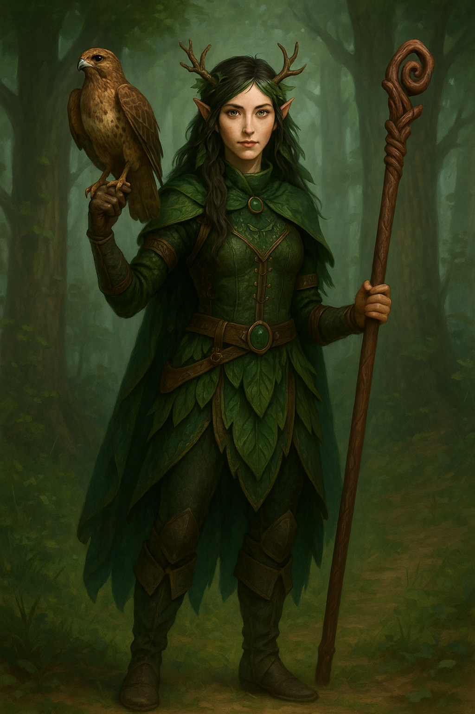

# ✧ Kai of the Hollow Glen ✧

![A wood elf druid with dark hair with green streaks, small antlers, wearing leaf-patterned green armor with leather belts, holding a wooden spiral staff, with an eagle perched on her arm, standing in a misty forest.]

> *"The wild does not waste words."*

**Guardian of Ancient Whispers**  
**Keeper of Rootbound Secrets**  
**Voice of the Forgotten Wild**

## Character Essence
**Race:** Wood Elf  
**Class:** Druid (Primal Order – Magician)  
**Age:** 132 (equivalent to a 26-year-old human)  
**Background:** Order of the Hollow Moon  
**Alignment:** Neutral Good

---

## 🌿 Presence & Appearance

Kai moves with the grace of a wind-stirred branch, her footsteps leaving no trace upon the forest floor. Her eyes—deep as ancient pools—carry wisdom beyond her years. There is a calm to her presence that makes even the wildest beasts part before her path, and trees seem to lean toward her as she passes.

She is not merely a druid who studies nature; she is *recognized* by the wild itself. The forest whispers her name in rustling leaves, and storms pause at her lifted hand.

### Physical Traits
* **Height:** Tall and imposing (5'10")
* **Build:** Slender yet strong, with a warrior's poise
* **Hair:** Long dark hair with distinctive green streaks that blend with the forest
* **Antlers:** Small, branch-like antlers grow naturally from her temples, marking her deep connection to woodland creatures
* **Eyes:** Piercing hazel-green that reflect both wisdom and vigilance
* **Skin:** Fair with a subtle glow that speaks of her fey ancestry
* **Attire:** Layered leaf-patterned armor in deep forest green, secured with leather straps and adorned with emerald gemstones at throat and belt
* **Cloak:** A hooded forest-green cape that helps her blend with the shadows of trees
* **Equipment:** Carries a twisted wooden staff with a spiral head, crafted from living wood that continues to grow

---

## 📜 Sacred Journey

> ✧ ✧ The Tale of Kai ✧ ✧

Born beneath the silver-veined canopy of **Hollow Glen**—an ancient woodland sanctuary that has outlasted empires—Kai's destiny was written in root and star. The glen stands protected not by walls but by ancestral whispers: rootbound wards, ancient oaths, and beasts that know no fear of steel.

Her childhood flowed with the rhythm of the forest:
> *"In dawn's first light, she learned the language of leaf and stem."*  
> *"When sun stood high, she ran with beasts who called her kin."*  
> *"As twilight fell, she sat at the feet of those who remembered the world's first song."*

She communed with animals before people. When she first felt pain, it was not her own—it was the blight creeping through roots, the unnatural stillness in birdsong.

---

### The Awakening

At 80 years of age, while her kin lingered in elven adolescence, Kai was accepted into the **Order of the Hollow Moon**, walking both arcane and natural paths. Where others mastered sword or arrow, she learned storm and soil. 

Her talents blossomed:
* **The Herbmaster's Gift** — Brewing clarity into golden tea that revealed forgotten memories
* **The Beast-Speaker's Tongue** — Calming raging beasts with voice alone, even those maddened by dark magic
* **The Runeweaver's Touch** — Speaking truths with leaves and ancient runes that could bind oaths to the very earth

She became renowned as a **keeper of balance and secrets**—one who could charm a wyvern or brew potions that recovered memories lost to time.

> "When she walks, the Old Forest remembers its first dream."  
> — Elder Sylvanir of the Whispering Council

---

## ⚔️ Combat Prowess

**✦ BATTLE ESSENCE ✦**

Kai fights like the forest itself—patient, unexpected, and devastating when provoked. Her movements mirror the dance of leaves in wind, fluid and unpredictable. She prefers to subdue rather than slay, but when protecting the balance, she becomes as merciless as winter.

### Core Statistics

**AC:** 13 | **HP:** 14 | **Initiative:** +2 | **Speed:** 35 ft | **Hit Dice:** 1d8

### Ability Scores

**STR:** 10 (+0) | **DEX:** 15 (+2) | **CON:** 14 (+2) | **INT:** 12 (+1) | **WIS:** 17 (+3) | **CHA:** 10 (+0)

### Battle Techniques

**🌙 Moonblade Sickle:**
- +2 to hit, 1d4 slashing damage
- Carved from a branch struck by lightning during a sacred moon ritual

**🌳 Rootkeeper Staff:**
- +2 to hit, 1d6 bludgeoning damage
- Hewn from the heart of an ancient oak that gave itself willingly

**⚡ Combat Proficiencies:**
- Proficiency Bonus: +2
- Saving Throws: Intelligence +3, Wisdom +5

**🐾 Beast Tactics:**
- Can coordinate attacks with animal companions
- Gains advantage when fighting alongside Vaelor

---

## ✨ Mystical Arts

**✧ The Arcane and Natural Flow Through Her Veins As One ✧**

### 🔮 Spellcraft (Level 1)

**Druidic Incantations:**
* **Cantrip:** Spare the Dying — With a touch, she anchors fading spirits to their mortal vessels
* **Prepared Spell:** Speak with Animals — The voices of beasts become clear as dawn's first light
* **Spell Save DC:** 13 — Few can resist her nature-born magic
* **Spell Attack Bonus:** +5 — Her magic strikes with the precision of a falcon

### 📊 Skills Mastery

**🌟 Mastered:**
- Animal Handling +5
- Perception +5
- Survival +5

**✨ Adept:**
- Arcana +4
- Nature +4

**🌱 Practiced:**
- Medicine +3
- Insight +3

**🍃 Familiar:**
- Persuasion +2
- Stealth +2

### 🧰 Tools & Languages

**Crafting Proficiencies:**
- **🍵 Brewer's Supplies:** Creates elixirs that reveal forgotten memories
- **🌿 Herbalism Kit:** Transforms simple plants into powerful remedies
- **🛤️ Vehicles (Land):** Guides carts through paths only the forest remembers

**Languages:**
- **📜 Common:** Speaks with deliberate precision, often using nature metaphors
- **🧝‍♀️ Elvish:** Her native tongue, musical and flowing like clear streams
- **🌳 Druidic:** The secret language of those who keep nature's deepest mysteries

> "Her magic is not learned, but remembered from when the world was young."

---

## 🦅 Loyal Companions

**⚔ Guardians of Sky and Spirit ⚔**

### VAELOR, THE GRIFFON-BONDED

> "Wings of storm, heart of thunder"

**AC:** 12 | **HP:** 59 | **Flying Speed:** 80 ft

**Bond:**
Born beneath the same silver moon as Kai, their spirits are eternally intertwined.

**Temperament:**
Proud and regal, with a piercing gaze that has made hardened warriors step back. His name echoes in legends told around wilderness campfires.

**Combat Prowess:**
Fierce in battle with razor talons and a devastating dive attack. Utterly devoted to Kai's protection and will fight to the death in her defense.

### ELARAN, THE HAWK GUARDIAN

> "Eyes that pierce both cloud and shadow"

**AC:** 12 | **HP:** 3 | **Flying Speed:** 60 ft

**Role:**
Scout and sentinel, whose keen eyes can spot a mouse from a thousand feet above.

**Services:**
Delivers messages written on leaf-parchment, detects approaching threats, and communes with wild birds to gather information across vast territories.

**Bond:**
Watchful, proud, and trusted more than most people. Connected to Kai through ancient familiar magic that allows them to share senses when needed.

> "When three hearts beat as one, neither steel nor shadow can stand against them."

---

## 🌙 Innate Abilities

* **Mask of the Wild:** Can attempt to hide when lightly obscured by natural phenomena
* **Fey Ancestry:** Advantage against being charmed, immunity to magical sleep
* **Trance:** Meditates for 4 hours instead of sleeping
* **Leave Druidic Message** (Special Action)
* **Two-Weapon Fighting** (Bonus Action option)
* **Darkvision:** 60 ft

---

## 🧠 Personal Quest

In recent decades, Kai has sensed a growing wrongness in the world. The signs are subtle but unmistakable:
* Beasts grow restless without cause
* Storms gather from directionless skies
* Trees bleed amber that poisons the earth

The elders name it a **"shadow without form"**—a corruption whose origin remains unknown.

Kai has volunteered to leave her sanctuary—not from rebellion, but from **duty**. The Glen has protected her for over a century; now she will protect it in return.

She journeys as the Glen's silent envoy, seeking the source of this corruption:
* Forgotten magic awakening in ruins
* Ancient oaths broken in darkness
* Or something older still, stirring beneath the world

She walks with ancient eyes and a belt full of herbs, scrolls, and secrets. She listens more than she speaks—but when she does, nature itself seems to listen back.

---

## 💔 Mortal Limitations

* Naive to human politics and courtly intrigue
* Speaks with unfiltered directness that can offend
* Tends to withdraw into isolation when overwhelmed
* Bears deep guilt for not leaving the Glen sooner
* Places the wellbeing of animals and nature above humans and other races

---

> *She is the whisper between branches, the stillness before storms, and the memory of stars in forgotten places.*